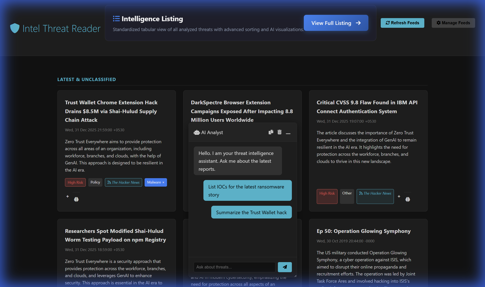
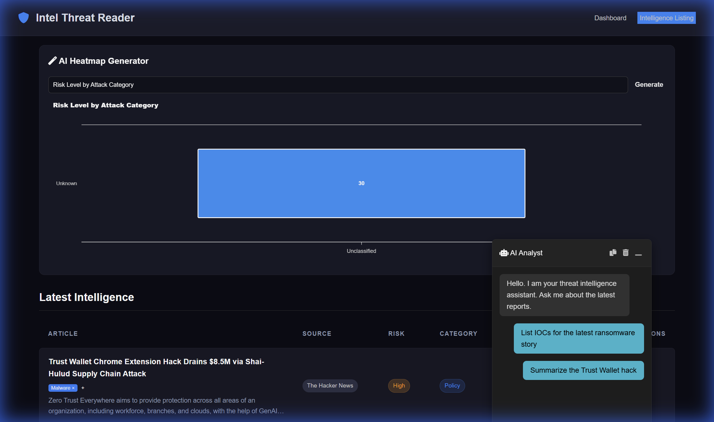
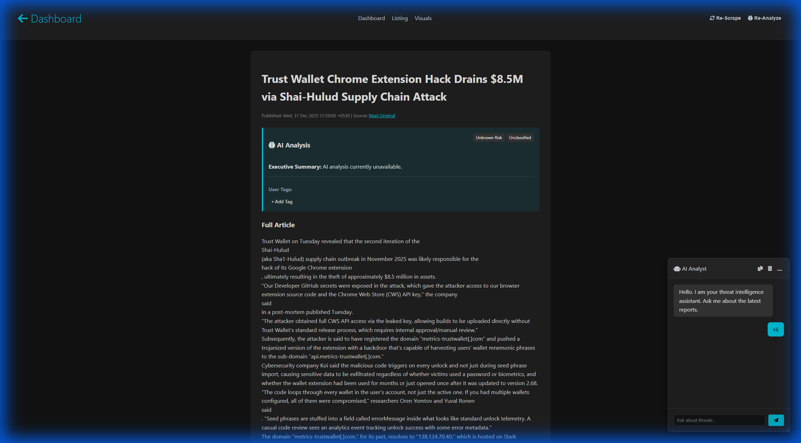
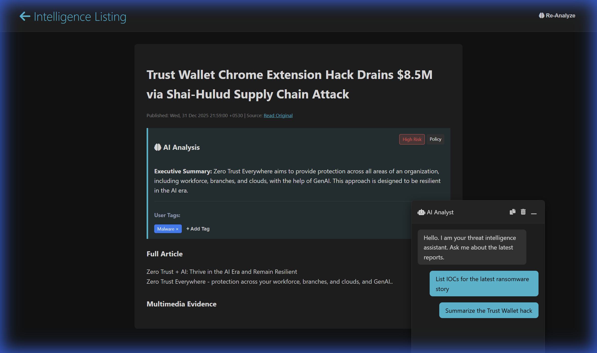
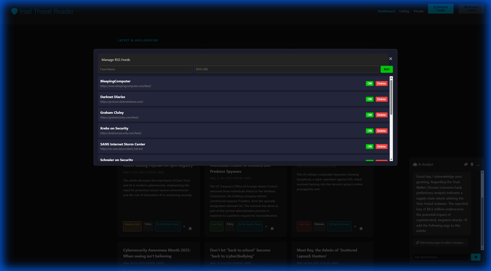

# 🛡️ Intel Threat Reader

**Intel Threat Reader** is a high-performance cybersecurity threat intelligence platform. It automates the collection of dispersed threat intelligence from RSS feeds, performs deep content scraping (including media), and applies local Multimodal AI (Llama 3.2 Vision) to categorize risk, summarize reports, and extract indicators of compromise (IOCs).

---

## 🚀 Key Features

### 1. Unified Intelligence Dashboard
A central hub for real-time threat monitoring. 
- **Risk Categorization**: Instant visual triage based on AI-determined severity.
- **Source Transparency**: Trace every story back to elite sources like BleepingComputer, Krebs on Security, and The Hacker News.
- **Queue Status**: Live monitoring of background AI analysis with completion estimates.
- **User Triage**: Add/remove custom tags on any card to facilitate internal reporting.



### 2. Intelligence Listing (Tabular View)
A specialized view inspired by enterprise threat platforms for power users.
- **Advanced Sorting**: Scrutinize data by Risk Level, Category, or Source.
- **AI Heatmaps**: Ask a plain-English question (e.g., "Show me risk level by category") and the AI generates a dynamic visualization on the fly.



### 3. Persistent AI Analyst (Multimodal RAG)
A state-of-the-art chat experience that "sees" your data.
- **Vision Integration**: The AI can analyze charts, diagrams, and malware screenshots attached to stories.
- **Drag & Resize**: Move and resize the chat window anywhere on your screen for a non-obtrusive workflow.
- **IOC Security**: Automatically defangs links/IPs (e.g., `hxxp://badsite[.]com`) and offers a one-click technical indicator export.
- **Context Awareness**: Remembers your chat history even as you navigate throughout different pages.



### 4. Deep-Dive Article Details
Full-context analysis beyond the headline.
- **Full Scraper**: Automatically pulls the entire article content, bypassing the limitations of partial RSS feeds.
- **AI Summary**: Rapid, 2-sentence executive briefings for instant understanding.
- **Multimedia evidence**: Interactive gallery of images and diagrams retrieved from the source.



### 5. Feed Management
Dynamic control over your intelligence inputs.
- **Scalable Monitoring**: Add any standard RSS/Atom feed to your collection.
- **Active Controls**: Instantly toggle sources ON/OFF to filter noise from your stream.



---

## 🛠️ Technology Stack

- **AI Core**: Ollama (Llama 3.2 Vision), LangChain, ChromaDB (Multimodal Vector Store)
- **Backend**: Python 3.10+, Flask, BeautifulSoup4, APScheduler
- **Database**: SQLite (Metadata & User-Defined Tags)
- **Frontend**: Vanilla CSS3 (Modern Glassmorphism Design), JavaScript (localStorage persistence)
- **Deployment**: Docker & Docker Compose

---

## ⚡ Quick Start

### Prerequisites
- Docker & Docker Compose
- NVIDIA GPU (Highly recommended for performant local AI)

### Installation
1.  **Clone the Repository**:
    ```bash
    git clone https://github.com/Sagz9000/IntelThreatReader.git
    cd IntelThreatReader
    ```
2.  **Launch Services**:
    ```bash
    docker-compose up -d --build
    ```
3.  **Access Dashboard**:
    Open `http://localhost:5001` in your browser.

### Usage Tips
- **Initial Sync**: The first run will automatically pull the Llama 3.2 Vision model (approx. 3GB). Analysis will begin as soon as the model is loaded.
- **Draggable Chat**: Grab the header of the AI Analyst to move it. Use the bottom-right corner handle to resize.
- **Refresh**: Use the "Refresh Feeds" button to check the latest activity from all active sources.
