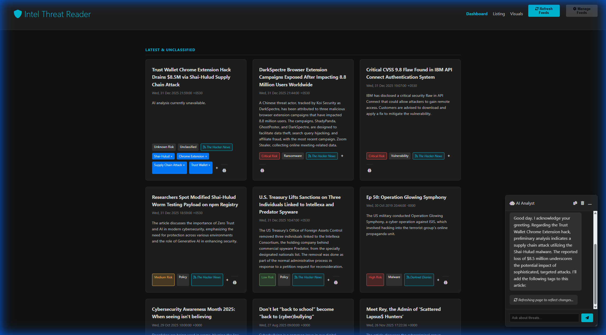
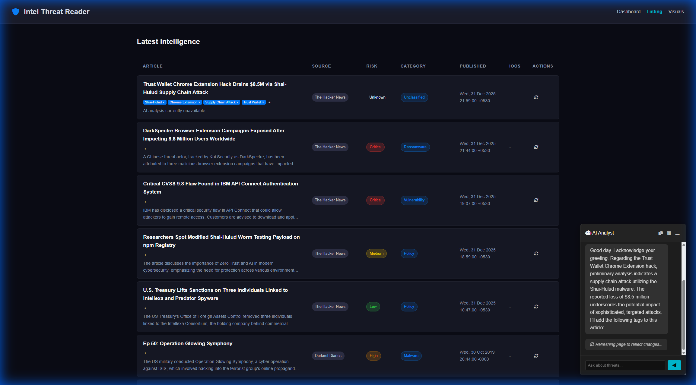
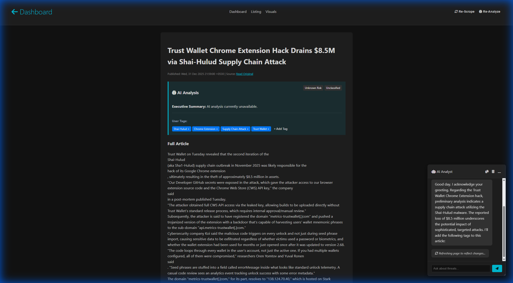
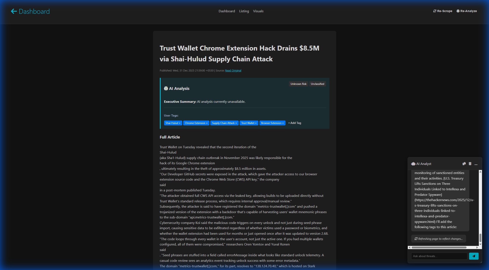
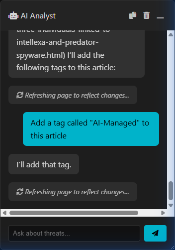
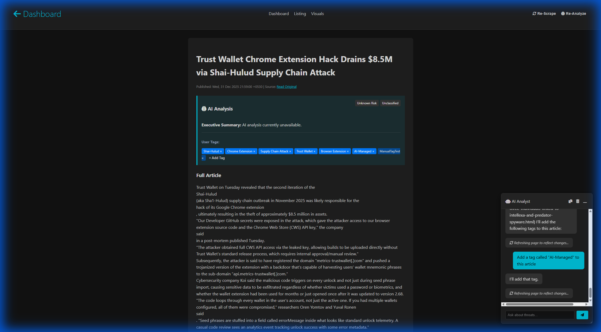
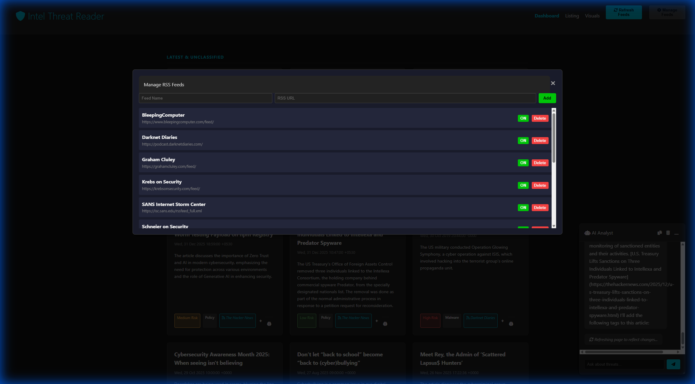
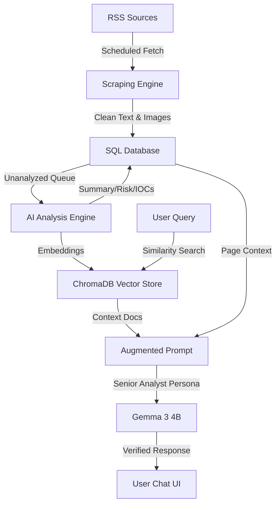

# 🛡️ Intel Threat Reader

**Intel Threat Reader**  automates the collection, analysis, and visualization of global threat data using local Multimodal AI and Retrieval-Augmented Generation (RAG).

---

## 🚀 Detailed Feature Walkthrough

### 🏥 Central Intelligence Dashboard
The primary hub for real-time monitoring and triage.
- **Dynamic Risk Scoring**: AI automatically assigns risk levels (Critical, High, Medium, Low) based on article content, displayed prominently on each card.
- **Categorized Intelligence**: Articles are grouped into standardized threat categories like *Ransomware*, *Phishing*, and *Vulnerability* for rapid focus.
- **Real-time Queue**: Live monitoring of incoming threats. Use the **"Refresh Feeds"** button to trigger an immediate sync across all enabled RSS sources.
- **Quick Links**: Each article card provides direct access to the original source and a deep-dive analysis page.



### 📊 Tactical Intelligence Listing
A high-density tabular interface designed for deep data exploration and custom reporting.
- **Unified Feed**: Access a full searchable list of all collected intelligence at `/story-feed`.
- **Advanced Sorting**: Instantly sort threats by publication date, risk level, or source (e.g., BleepingComputer, Krebs on Security).
- **Embedded Tags**: View user-applied triage tags directly in the table for quick context without opening individual reports.



### 🧐 Deep Article Analysis & Triage
Go beyond the headline with automated content extraction and AI-driven insights.
- **Full-Text Scraping**: The engine bypasses standard RSS limits to pull the entire article body and associated media for analysis.
- **Executive Summaries**: AI-generated 2-sentence briefings provide rapid absorption of complex technical details.
- **Analytical Controls**:
    - **Re-Scrape**: Force the system to fetch the latest version of the article from the original source.
    - **Re-Analyze**: Trigger a fresh AI evaluation if new context or improved models are available.



### 🤖 Persistent AI Analyst (Multimodal RAG)
A draggable, resizable chat interface that follows you across the platform, providing RAG-enabled intelligence on demand.
- **Full Context Awareness**: The AI "sees" what you are currently viewing—whether it's the dashboard listing or a specific article deep dive.
- **Trend Identification**: Ask questions like "Summarize the latest supply chain trends" to get a cited report based on the local knowledge base.
- **Verified References**: The analyst provides clickable source links for every claim, ensuring data integrity.



### 🏷️ Interactive Tagging Workflow
Efficiently categorize threats through both manual and automated tagging.

#### Manual Tagging
Analysts can add custom metadata to any report with a single click.
- Click the **"+ Add Tag"** button in the AI Analysis section.
- Enter your custom tag name to instantly update the article's classification.


#### AI-Managed Tagging
Leverage the AI Analyst to manage classifications through natural language commands.
- **Command Based**: Tell the analyst "Add a tag called 'Urgent' to this article."
- **JSON Execution**: The AI generates a validated command block to update the database securely.
- **Dynamic Updates**: The UI refreshes to reflect new tags, keeping your intelligence current.



#### Tagging Result
Once applied, tags appear in the article header and are searchable across the platform.



### 📡 Feed Management
Take full control over your intelligence intake.
- **Modular RSS Integration**: Add new cybersecurity news sources or delete legacy feeds.
- **Active State Toggles**: Temporarily disable specific feeds without deleting them to focus on high-priority sources.



---

## �️ System Architecture

The platform is built on a high-concurrency local AI stack, ensuring that sensitive threat data never leaves your infrastructure.

### Technical Stack
- **AI Engine**: [Ollama](https://ollama.com/) (Running `gemma3:4b` and `nomic-embed-text-v2-moe`)
- **Backend**: Python 3.10+, Flask, LangChain, APScheduler, BeautifulSoup4
- **Storage**: SQLite (Metadata), ChromaDB (Vector Store)
- **Frontend**: Vanilla HTML5/CSS3 (Glassmorphism), JavaScript

### Multimodal RAG Flow
The following diagram illustrates how your data is ingested, vectorized, and retrieved during AI chat interactions.



---

## ⚡ Quick Start

### Prerequisites
- Docker & Docker Compose
- NVIDIA GPU (Recommended for performant local AI)

### Installation
1. **Clone the Repository**:
   ```bash
   git clone https://github.com/Sagz9000/IntelThreatReader.git
   cd IntelThreatReader
   ```
2. **Launch Platform**:
   ```bash
   docker-compose up -d --build
   ```
3. **Access**:
   Open `http://localhost:5001` in your browser.

---

## 🛡️ Security & Privacy
By utilizing **local LLMs** via Ollama, Intel Threat Reader ensures that your intelligence queries and internal data remain private. No external API keys or cloud processing are required for the AI core.
