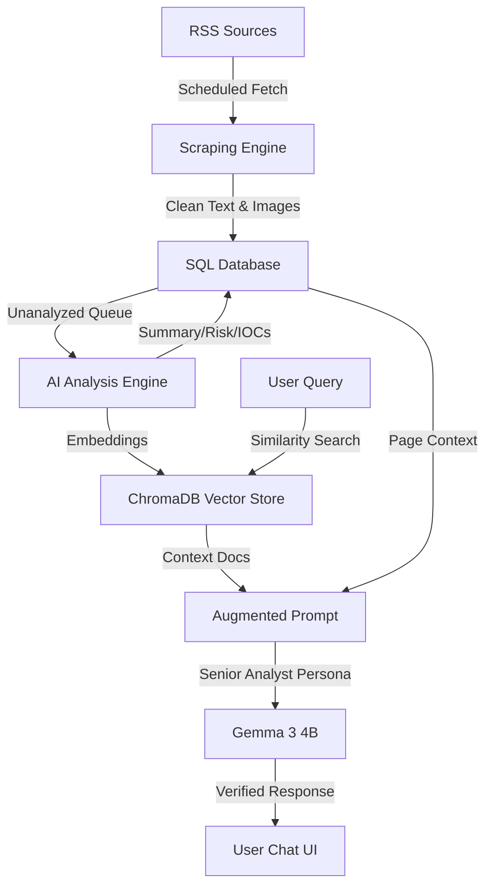

# 🛡️ Intel Threat Reader

**Intel Threat Reader** is an advanced cybersecurity threat intelligence platform designed for analysts and security leaders. It automates the collection, analysis, and visualization of global threat data using local Multimodal AI and Retrieval-Augmented Generation (RAG).


---

## 🚀 Feature Walkthrough

### 🏥 Central Intelligence Dashboard
The primary hub for real-time monitoring and triage.
- **Dynamic Risk Scoring**: AI automatically assigns risk levels (Critical, High, Medium, Low) based on article content.
- **Queue Status**: Live monitoring of deep-analysis tasks with periodic updates and estimates.
- **Triage Tags**: Analysts can add custom tags directly to cards for internal categorizing.


### 📊 Tactical Listing & Visualizations
A tabular interface for deep data exploration and custom reporting.
- **AI Data Analyst**: Ask questions in plain English (e.g., "Show me a pie chart of categories") to generate dynamic charts and heatmaps on the fly.
- **Multi-Source Triage**: Quickly sort by source (BleepingComputer, The Hacker News, Krebs, etc.) or publication date.


### 🧐 Deep Article Analysis
Go beyond the headline with automated content extraction.
- **Full-Text Scraping**: Bypasses RSS limitations to pull entire article bodies and associated media.
- **Executive Summaries**: AI-generated 2-sentence briefings for rapid absorption.
- **Re-Scrape & Re-Analyze**: One-click buttons to force a fresh fetch from the source or a new AI evaluation.


### 🤖 Persistent AI Analyst (Multimodal RAG)
A draggable, resizable chat interface that follows you across the platform.
- **Senior Analyst Persona**: Interacts with the professional tone of a Senior CTI Analyst.
- **Full Context Awareness**: The AI "sees" what you are looking at—summarizing the current page or specific visible articles.
- **Verified Intelligence**: References its internal knowledge base (ChromaDB) to provide cited takeaways and defanged IOCs.


---

## 🏗️ Architecture & RAG Logic

The platform is built on a high-concurrency local AI stack, ensuring that sensitive threat data never leaves your infrastructure.

### Technical Stack
- **AI Engine**: [Ollama](https://ollama.com/) (Running `gemma3:4b` and `nomic-embed-text-v2-moe`)
- **Backend**: Python 3.10+, Flask, LangChain, BeautifulSoup4
- **Storage**: SQLite (Metadata), ChromaDB (Vector Store)
- **Frontend**: Vanilla HTML5/CSS3 (Glassmorphism), JavaScript

### Multimodal RAG Flow
The following diagram illustrates how your data is ingested, vectorized, and retrieved during AI chat interactions.



---

## ⚡ Quick Start

### Prerequisites
- Docker & Docker Compose
- NVIDIA GPU (Recommended for performant local AI)

### Installation
1. **Clone the Repository**:
   ```bash
   git clone https://github.com/Sagz9000/IntelThreatReader.git
   cd IntelThreatReader
   ```
2. **Launch Platform**:
   ```bash
   docker-compose up -d --build
   ```
3. **Access**:
   Open `http://localhost:5001` in your browser.

---

## 🛡️ Security & Privacy
By utilizing **local LLMs** via Ollama, Intel Threat Reader ensures that your intelligence queries and internal data remain private. No external API keys or cloud processing are required for the AI core.
